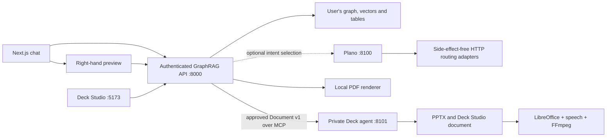

# Knowledge documents and the agent boundary

## What runs where



These are separate processes/services, not necessarily separate machines. One computer is enough for development. The Deck agent has no access to the knowledge database. The main API owns authentication, retrieval, grounding checks and the approved content snapshot. Both services persist their jobs in SQLite; long renders run in isolated subprocesses. The browser accesses generated files through the main API.

PDF requests use the existing retrieval pipeline and render headings, paragraphs, tables, code and display equations with embedded fonts and page numbers. Spreadsheet exports use read-only queries and reject truncated results. A document that fails source verification gets one source-focused revision and must pass the same check. Presentation requests and approved content go to Deck Studio: its planner chooses a template and photo sections, its image engine selects licensed images, and the renderer paginates the approved text without rewriting it. Images are copied into each job for authenticated preview, download and editing. When image providers have no suitable result, a source overview image keeps the cover illustrated. Unsupported LaTeX is preserved as readable source notation instead of failing the export.

“Create a video about X” retrieves X, creates a presentation internally, then returns a video card. “Make a video of this presentation” reuses the latest completed deck in that chat. Video previews offer both MP4 and PPTX downloads. The separate editor uses the existing Deck Studio canvas, with revision checks to prevent one tab overwriting another. Edits are explicitly marked as no longer the approved source snapshot.

## Run locally

Use Python 3.12 and the existing Node setup. Keep the API and agent virtual environments separate. From the repository root:

```powershell
python -m venv backend/.venv
backend/.venv/Scripts/python -m pip install -r backend/requirements.txt ./packages/artifact-core
python -m venv Agents/A1_pptx/.venv
Agents/A1_pptx/.venv/Scripts/python -m pip install -r Agents/A1_pptx/requirements.txt ./packages/artifact-core
```

Set the following in `backend/.env`, retaining your existing retrieval and authentication settings:

```dotenv
AGENT_SHARED_SECRET=<random secret of at least 32 characters>
DECK_AGENT_URL=http://127.0.0.1:8101
DECK_STUDIO_URL=http://localhost:5173
PLANO_ROUTER_URL=
ARTIFACT_RETENTION_DAYS=30
```

Generate the secret once with `python -c "import secrets; print(secrets.token_urlsafe(48))"`. Put that same value in `Agents/A1_pptx/.env`. Do not put it in a frontend variable. Set the agent's `GROQ_API_KEY` to enable Deck Studio's design planner and natural narration. Without it, source layouts and verbatim narration remain available. Wikimedia image search needs no key; Unsplash, Pexels and Pixabay use the corresponding keys in the agent environment. Compose forwards these optional keys from its environment file.

Start everything with the repository runner — one command for every backend,
one for every front end. It discovers agents from `Agents/*/agent.json`, frees
occupied ports, and regenerates the agent registry:

```powershell
python run.py backend     # main API :8000 + every agent backend (:8101 here)
python run.py frontend    # Next.js :3000 + Deck Studio :5173
```

Full setup, environment and troubleshooting live in [run.md](../run.md).

The integrated service is `backend.integrated:app`; the agent's original `backend.main:app` remains its standalone studio API. Do not expose that standalone API as the multi-user agent endpoint.

For video, install [LibreOffice](https://www.libreoffice.org/download/download-libreoffice/) and set `LIBREOFFICE_PATH` in the agent environment if `soffice` is not on PATH. On Windows it is commonly `C:/Program Files/LibreOffice/program/soffice.exe`. Alternatively, installed Microsoft PowerPoint plus pywin32 works. `edge-tts` needs internet access and sends the narration text to Microsoft's speech service. It has no paid API key, but is not an offline service or an availability guarantee. FFmpeg is provided by `imageio-ffmpeg`. Use the container route below for a Linux service with LibreOffice and FFmpeg already included.

Try “Create a PDF explaining hybrid retrieval”, “Create a presentation about the uploaded report”, then “Make a video of this presentation”. Requests need source material in the current user's knowledge base.

## Deployment and cost

From the repository root, with Docker installed and `backend/.env` configured:

```sh
docker compose -f deploy/compose.yaml --env-file backend/.env up --build
```

This starts the two Python services with separate storage volumes. The Deck agent is private on the container network. Deploy the two existing frontends separately: Next.js as usual, and the Vite production build of Deck Studio as static assets. Set `NEXT_PUBLIC_API_BASE_URL` for the main frontend, `VITE_NODERELS_API_URL` for the studio, and `DECK_STUDIO_URL` for the API to their real HTTPS origins. Frontend variables are build-time settings. The studio validates its bridge origin; production must not use the localhost default. Configure the existing API CORS origin setting as well; the studio origin is added automatically.

Keep `AUTH_DISABLED=false` in production and configure the existing Supabase verification settings. Use TLS, a trusted reverse proxy and private networking. Set `MCP_ALLOWED_HOSTS` on the agent when its hostname changes. If a remote machine is used, `DECK_AGENT_URL` must use HTTPS. Configure forwarded headers only for trusted proxies so generated URLs have the public HTTPS origin. Redact query strings from proxy logs: preview/download tickets are short-lived bearer capabilities. Uvicorn access logging is disabled in the supplied containers for this reason.

PDF/PPT rendering and MCP use no paid service. The main answer model retains your current Groq/OpenRouter/Ollama configuration. Hosting, GPU compute, bandwidth and third-party free-tier availability are separate costs. No paid subscriptions or hosting were created.

## Plano: researched boundary and optional configuration

The [Plano orchestration documentation](https://docs.planoai.dev/guides/orchestration.html), checked against v0.4.36, describes HTTP agents using the OpenAI Chat Completions format. It still lists agents-as-tools over MCP as forthcoming. Consequently, `deploy/plano_config.yaml` routes to four tiny HTTP adapters that return a format selection. The authenticated main API validates that selection, prepares knowledge, and makes the actual MCP call. This avoids pretending Plano already executes these MCP tools directly.

Start Plano with `planoai up deploy/plano_config.yaml` using the [official CLI instructions](https://docs.planoai.dev/resources/cli_reference.html). Its listener is port 8100. Set `PLANO_ROUTER_URL=http://127.0.0.1:8100` on the API after it is healthy. The file explicitly selects a self-hosted `katanemo/Plano-Orchestrator-4B` endpoint on port 8102; follow the [official local-model deployment instructions](https://docs.planoai.dev/guides/llm_router.html). That GPU model is an additional prerequisite, not installed by Compose. Container users must replace loopback addresses with reachable service addresses. A routing timeout falls back to the explicit English request matcher; ordinary chat does not require Plano.

The MCP implementation uses the [official Python SDK](https://github.com/modelcontextprotocol/python-sdk), Streamable HTTP, authenticated requests and a server-controlled endpoint registry. The model never supplies an executable command or an agent URL.

## Scaling toward 50–100 capabilities

Keep a stable contract per capability: validated input, submit/status tools, owner identity, versioned results and bounded execution. Add an entry to the administrator-controlled registry and an explicit handler/routing description when a real agent exists. The registry is not automatic permission to execute arbitrary tools. Similar capabilities can share a service; 100 tools do not require 100 always-running model processes.

Current controls include three active jobs per user per queue, 100 active jobs globally per queue, 100 retained jobs per user, a 1 GiB free-disk admission floor, configurable retention, job timeouts and restart recovery. `ARTIFACT_MAX_SAVED_PER_USER`, `ARTIFACT_MIN_FREE_BYTES` and `ARTIFACT_RETENTION_DAYS` can be set on both services. The renderer defaults to one worker; increase `AGENT_WORKERS` only after measuring CPU/RAM use. Video work is deliberately bounded because encoding is much more expensive than creating PPTX.

The existing GraphRAG file stores and embedded Qdrant still require one API worker. The new queue does not make those stores safe for multiple writers. Before horizontal API scaling, migrate vector and graph/KV storage to shared services, job metadata to PostgreSQL, and files to object storage with lifecycle rules. Then add a shared worker queue if independent worker scaling is needed. Use per-agent credentials/audiences or workload identity when services cross trust boundaries; the initial shared secret is appropriate only for this trusted two-service deployment. Load-test concurrent users and queue saturation before promising throughput.

## Verification and limits

`scripts/verify_artifacts.py` is a runnable offline regression check. It starts a real MCP agent process, renders PDF and PPTX, verifies exact sample table/formula content, checks tenant isolation and ranged downloads, and exercises editor revisions and narration fallback. Run it from the repository root in an environment with both services' dependencies installed:

```sh
python scripts/verify_artifacts.py
```

The existing chat storage, retrieval budget and tenancy regression suite also passed (37 tests). Main frontend TypeScript/lint and the studio production build were checked. Desktop/mobile preview layout was inspected in the browser using synthetic content.

The initial checks ran in a separate verification environment because the sandbox could not launch the installed Python interpreter. A subsequent check outside the sandbox confirmed that `backend/.venv` works; it does not need rebuilding. Install and start the backend with that environment's Python to avoid accidentally using global packages. The temporary API used for browser verification was stopped and never used the real knowledge store.

The live knowledge-model response was not exercised against the user's private knowledge base. Existing lexical grounding checks reduce unsupported output but do not prove factual correctness. Source recovery and rejection are covered by focused backend tests. Equations supported by matplotlib mathtext are typeset; other LaTeX stays visible as source notation. Connected Studio supports editing existing text, tables, shapes and assets; its standalone AI/image search controls remain unavailable through the restricted bridge.

Video verification now runs real PowerPoint rendering, Windows SAPI narration and FFmpeg encoding, and decodes the MP4 to verify both audio and video streams. Run `python scripts/verify_artifacts.py .verification/artifacts-check --video` in the verification environment. Online speech is retried three times and falls back to an installed local voice; set `VIDEO_TTS_ENGINE=local` on the agent to choose offline narration. Linux containers include espeak-ng. The test also covers Studio planning, embedded images, authenticated image downloads, editor revisions, formula fallback and speech retries. The backend suite passed 163 tests; the image engine passed 13 checks; frontend TypeScript and the Studio production build passed. Docker, the local Plano model and production-scale load remain untested.
